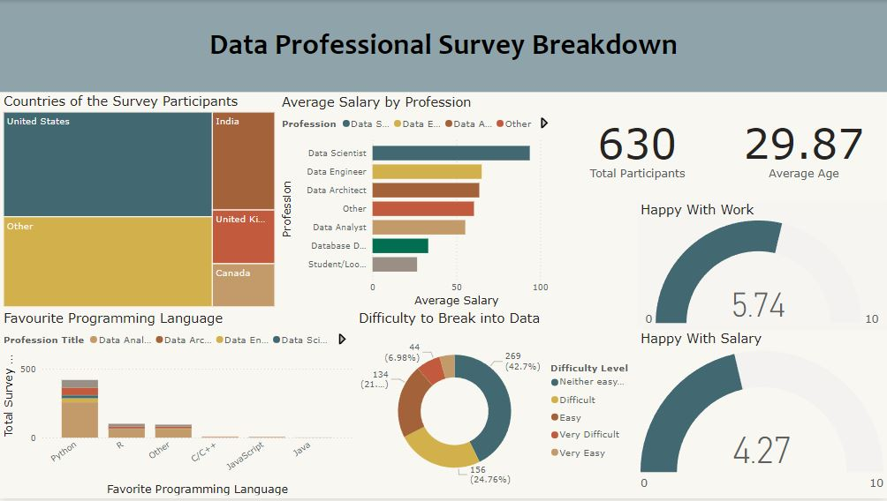

# Data Professional Survey Breakdown
<h3>Introduction</h3>
This report presents findings from a survey of 630 data professionals, with insights into demographics, job satisfaction, salary distribution, and entry challenges within the data industry. The analysis addresses key questions regarding participant demographics, average salaries across professions, preferred programming languages, the ease of entering the field, and overall job and salary satisfaction.

<h3>Data Cleaning and Preparation</h3>
[View Raw Dataset](https://github.com/Tanima2013/Data-Professional-Survey-Breakdown/blob/main/Project_Dataset.xlsx)

To ensure accurate analysis and insights, the data was first cleaned and transformed using Power Query. The following steps were taken to make the data usable for this report:

<h4>1. Removal of Empty Columns:</h4>
Columns with empty values were identified and removed to streamline the dataset and focus on relevant data points.

<h4>2. Calculating Average Salary from Ranges:</h4>
Some entries had salary information represented as ranges (e.g., "$50,000 - $60,000"). To standardize this, the average salary was calculated for each range, and a new column titled "Average Salary" was created to store these values. This enabled a more precise analysis of salary trends across professions.

<h4>3. Standardizing "Other" Values in Categorical Columns:</h4>
Certain columns contained various entries labeled with different variations of "Other". These entries were standardized by consolidating them into a single "Other" category. This was achieved using the split column function, allowing for a clearer and more organized representation of categorical data.
These data cleaning steps ensured consistency and accuracy in the dataset, providing a solid foundation for further analysis and insights.

<h3>Dashboard:</h3> 

 
<h3>Key Questions (KPIs)</h3>

<h4>1. What is the demographic breakdown of survey participants?</h4>
The participants primarily come from the United States, followed by the United Kingdom, Canada, India and other countries, showing a diverse international representation.

<h4>2. What is the average salary by profession within the data field?</h4>
Among data professions, Data Scientists report the highest average salaries, followed by Data Engineers, Data Architects, and Data Analysts, highlighting the salary variations within different roles in the data industry.

<h4>3. Which programming languages are most preferred among data professionals?</h4>
Python stands out as the most popular programming language, indicating its central role in data-related work. Other languages like R, SQL, C/C++, and JavaScript are used but are less common than Python.

<h4>4. How difficult do data professionals find it to break into the field?</h4>
Responses show that 42.7% of participants found it "Neither easy nor difficult" to enter the field. Meanwhile, 24.76% rated it as "Difficult," 21.27% found it "Easy," 6.98% described it as "Very Difficult," and 4.29% found it "Very Easy." This mixed feedback indicates moderate challenges for newcomers, with a variety of experiences.

<h4>5. What is the level of job and salary satisfaction among data professionals?</h4>
The average satisfaction with work is 5.74 out of 10, while satisfaction with salary is slightly lower at 4.27 out of 10, suggesting that while data professionals generally enjoy their roles, compensation may not fully meet their expectations.

<h3>Insights</h3>

<h4>1. Geographic Distribution:</h4>
The United States and India are the largest contributors to the survey, followed by other countries, reflecting a strong global community of data professionals.

<h4>2. Average Salary by Profession:</h4>
Data Scientists earn the highest average salary among the roles surveyed. Other positions, such as Data Engineers, Data Architects, and Data Analysts, have varied but generally lower salary averages, reflecting differences in roles and responsibilities.

<h4>3. Favorite Programming Language:</h4>
Python’s popularity highlights its importance in the data field, making it the preferred tool among data professionals. While R, SQL, and other languages are also used, they are secondary to Python.

<h4>4. Difficulty in Entering the Data Field:</h4>
The responses indicate that many professionals feel neutral (42.7%) about the ease of entering the field, with a mix of opinions ranging from easy to difficult. This suggests that while some find it manageable, others face significant challenges, pointing to a moderate barrier to entry in the data profession.

<h4>5. Job Satisfaction:</h4>
Data professionals report moderate satisfaction with their work (5.74/10) but lower satisfaction with salaries (4.27/10). This suggests that while many enjoy their work, there may be room for improvement in compensation.

<h3>Conclusion</h3>
The survey provides insights into the data profession, highlighting the global reach and diversity of the field. While data professionals generally appreciate their work, satisfaction with salary could be improved. The mixed responses regarding entry difficulty suggest that entering the data field can be challenging but manageable for those with the right skills and resources. Python’s dominance as the programming language of choice reaffirms its critical role in data-related tasks, reinforcing its status as a fundamental tool in the field.
